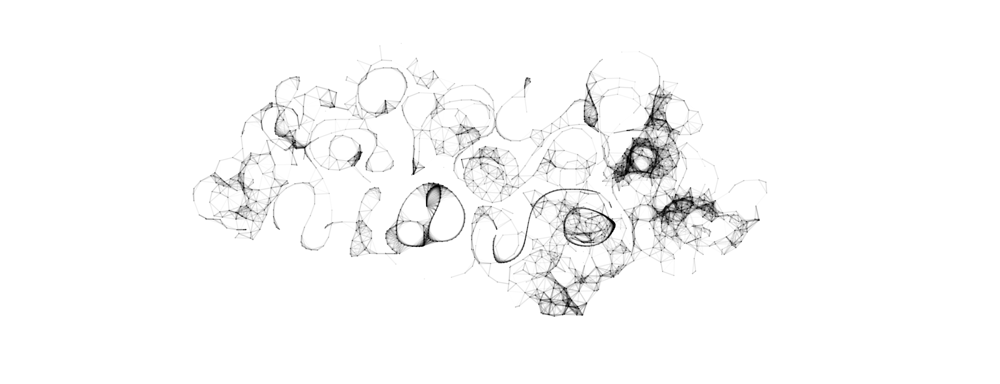
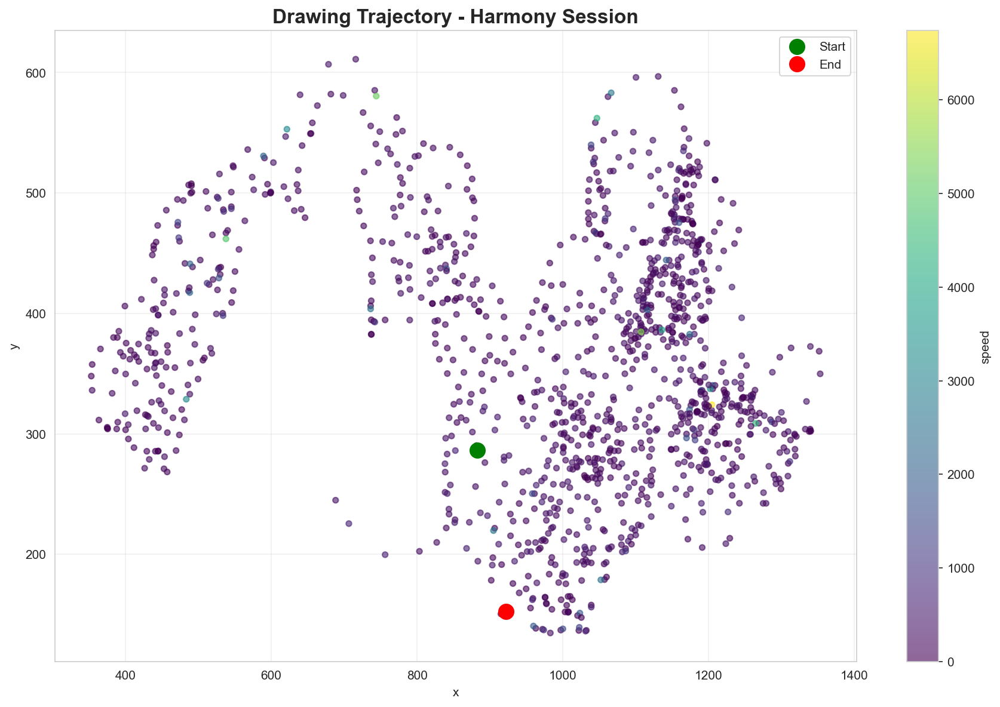
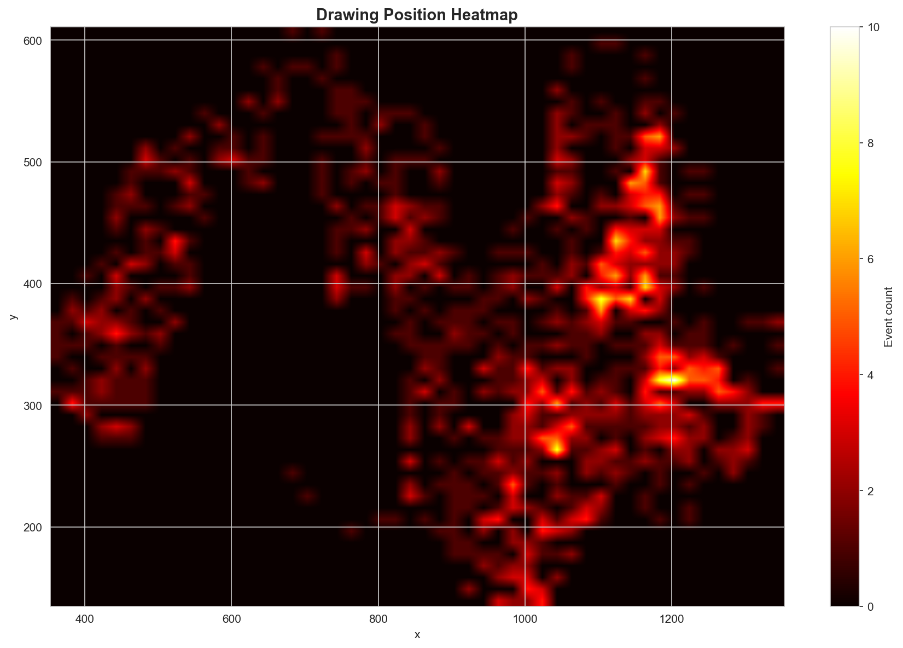
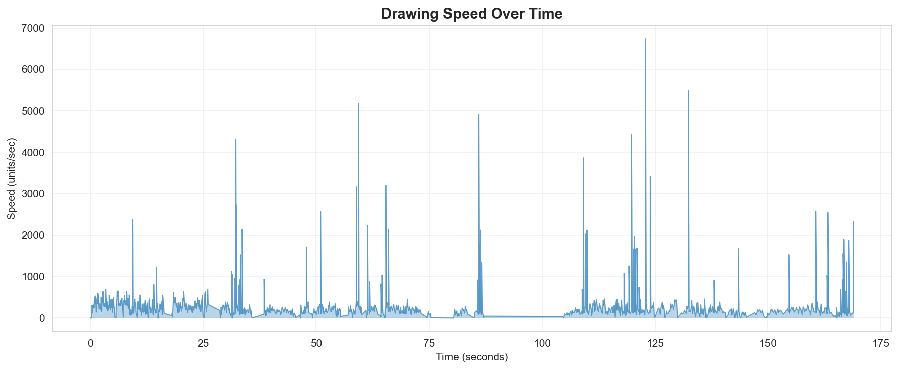

# Harmony Sessions Tracking and Data App

A macOS app for recording and analyzing trackpad drawing behavior using the Harmony shaded brush algorithm.

## Overview

This project provides a native macOS application that combines:
- **Drawing canvas** with Harmony's shaded brush effect
- **Trackpad event logging** capturing all movements, gestures, and timestamps
- **Screen recording** automatically captures your entire desktop during sessions
- **Camera recording** captures face video for eye tracking analysis
- **Session recording** with automatic CSV + PNG + MOV export
- **Real-time timer** for tracking drawing session duration
- **Eye tracking analysis** extracts gaze, blinks, and fixations from camera videos

## Quick Start

### Requirements
- macOS (tested on macOS 11+)
- Xcode (for building the app)

### Building the App

1. Open the project in Xcode:
   ```bash
   open savantlab-trackpad-macOS/savantlab-trackpad-macOS.xcodeproj
   ```

2. Build and run (⌘R) or use the helper script:
   ```bash
   scripts/run_trackpad_app.sh
   ```

### Using the App

1. **Start Recording** - Click the button or press Space
2. **Draw** - Use your trackpad to create drawings with the shaded brush
3. **Stop Recording** - Click again to save the session
4. **Clear Canvas** - Start a new drawing session

### Output Files

Each recording session automatically saves four files to `~/Documents/savantlab-trackpad-sessions/`:

- **`session-YYYYMMDD-HHMMSS.csv`** - Trackpad event log with:
  - Timestamp (ISO 8601 with fractional seconds)
  - Event type (mouseMoved, leftMouseDragged, scrollWheel, magnify, rotate, swipe)
  - Position (x, y)
  - Deltas (deltaX, deltaY)
  - Scroll amounts
  - Phase information

- **`session-YYYYMMDD-HHMMSS.png`** - Screenshot of your drawing

- **`session-YYYYMMDD-HHMMSS.mov`** - Full desktop screen recording of your session

- **`session-YYYYMMDD-HHMMSS-camera.mov`** - Face/camera video for eye tracking analysis

> **Note:** Screen and camera recording require permissions on first use. macOS will prompt you to allow access in System Settings > Privacy & Security.


*Example saved drawing with Harmony shaded brush effect*

## App Features

### Harmony Shaded Brush

The drawing canvas implements the authentic Harmony shaded brush algorithm:
- Each stroke point connects to all nearby previous points
- Line opacity decreases with distance
- Creates organic, webbed shading effects
- White background with black brush by default

### Recording Controls

- **Start/Stop Recording** button (or press Space)
- **Live timer** showing recording duration (MM:SS.T)
- **Clear Canvas** button to reset for new sessions
- **Session file display** showing the output filename

### Event Logging

Captures comprehensive trackpad data:
- Mouse movements and drags
- Scroll gestures (two-finger pan)
- Pinch/zoom gestures (magnify)
- Rotation gestures
- Swipe gestures
- All with precise timestamps

## Data Analysis

The analysis pipeline provides comprehensive insights into drawing behavior and eye tracking data.

### Eye Tracking Analysis

Extract detailed eye metrics from camera recordings:

```bash
cd analysis
./setup_eyetracking.sh  # One-time setup
source venv-eyetracking/bin/activate

python -c "
from pathlib import Path
import eye_tracking

sessions_dir = Path.home() / 'Library/Containers/savant.savantlab/Data/Documents/savantlab-trackpad-sessions'
camera_file = list(sessions_dir.glob('*-camera.mov'))[0]
output_csv = camera_file.parent / camera_file.name.replace('-camera.mov', '-eye-tracking.csv')

tracker = eye_tracking.EyeTracker()
df = tracker.process_video(camera_file, output_csv)
"
```

Extracts:
- Gaze direction and position
- Eye openness (left/right)
- Pupil positions
- Blink detection and rate
- Fixations (stable gaze)
- Saccades (rapid eye movements)
- Eye movement velocity

Output: `session-YYYYMMDD-HHMMSS-eye-tracking.csv` with frame-by-frame eye metrics.

### Example Visualizations

| Trajectory Analysis | Position Heatmap |
|:-------------------:|:----------------:|
|  |  |
| Drawing path colored by speed | Areas of concentrated activity |


*Drawing speed over time - shows velocity patterns and rhythm*

### CSV Format

The event log CSV contains the following columns:

```csv
timestamp_local,event_type,x,y,deltaX,deltaY,phase,scrollDeltaX,scrollDeltaY,touch_id,touch_phase,touch_normalizedX,touch_normalizedY,touch_isResting
```

### Python Analysis (Optional)

For analysis, you can use Python with pandas:

```bash
python3 -m venv .venv
source .venv/bin/activate
pip install pandas matplotlib numpy jupyter
```

Example analysis:

```python
import pandas as pd
import matplotlib.pyplot as plt

# Load session data
df = pd.read_csv('~/Documents/savantlab-trackpad-sessions/session-20251117-231352.csv')

# Convert timestamp to datetime
df['timestamp'] = pd.to_datetime(df['timestamp_local'])

# Plot movement trajectory
drags = df[df['event_type'] == 'leftMouseDragged']
plt.plot(drags['x'], drags['y'])
plt.title('Drawing Trajectory')
plt.show()

# Analyze gesture usage
print(df['event_type'].value_counts())
```

## Project Structure

```
harmony-sessions/
├── savantlab-trackpad-macOS/     # Swift/SwiftUI macOS app
│   ├── savantlab/                 # App source code
│   │   ├── savantlabApp.swift     # Main app entry point
│   │   ├── HarmonyTrackpadLabView.swift  # Main UI
│   │   ├── NativeDrawingView.swift       # Canvas with Harmony brush
│   │   ├── TrackpadEventLogger.swift     # Event recording logic
│   │   ├── ScreenRecorder.swift          # Desktop screen recording
│   │   └── harmony-master/        # Harmony brush JS (reference)
│   └── savantlab-trackpad-macOS.xcodeproj/
├── scripts/
│   └── run_trackpad_app.sh        # Build and launch helper
└── README.md
```

## Credits

- Harmony brush algorithm by [Mr.doob](https://github.com/mrdoob/harmony)
- Built with Swift, SwiftUI, and AppKit
